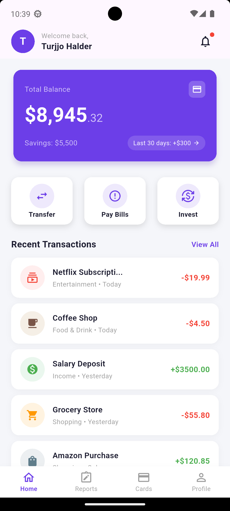
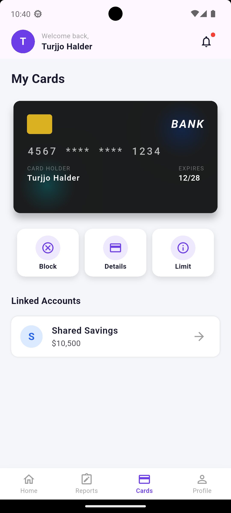
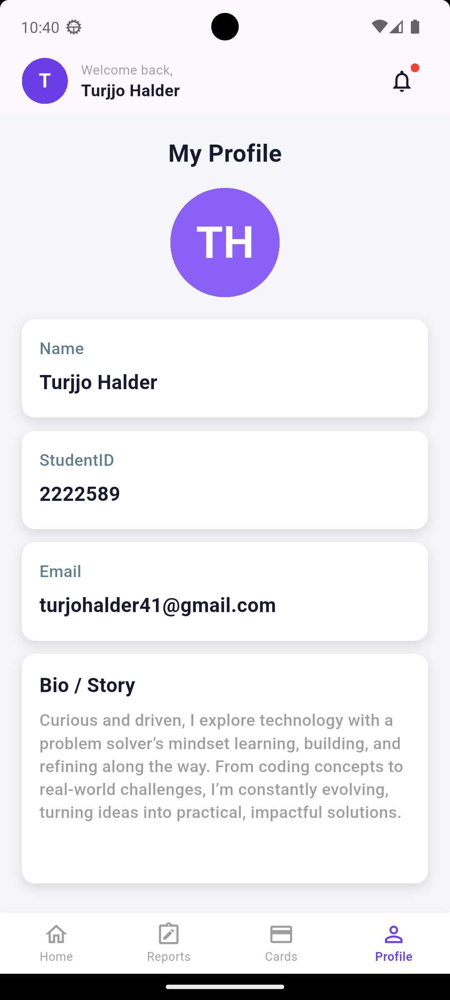
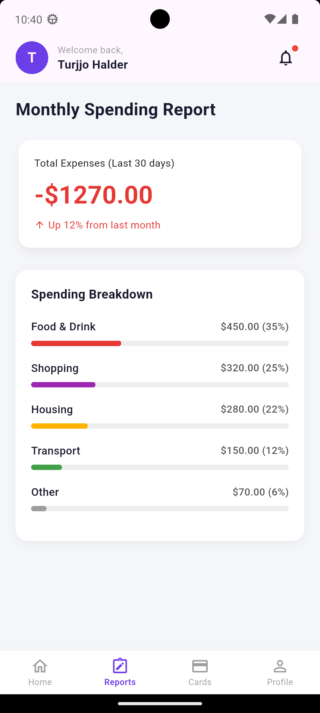

# Money Control App

A Flutter practice project built to sharpen my UI development skills by converting a **Figma design into a fully functional Flutter UI** — achieving approximately **99.5% visual accuracy** to the original design.

This project focuses purely on pixel-perfect UI implementation, covering common finance-app screens like balance overview, transaction history, spending breakdown, and user profile.

## 📱 Screenshots

| Home | Cards |
|:---:|:---:|
|  |  |

| Profile | Reports |
|:---:|:---:|
|  |  |

## ✨ Features

- Pixel-perfect UI conversion from Figma to Flutter
- Custom-built reusable widgets (balance cards, bank cards, transaction items, spending breakdown, etc.)
- Bottom navigation with multiple screens (Home, Cards, Reports, Profile)
- Custom app bar and action button components
- Clean, modular project structure separating screens and widgets

## 🛠️ Built With

- **Flutter** — UI toolkit
- **Dart** — Programming language

## 📂 Project Structure

```
lib/
├── screens/
│   ├── card_page.dart
│   ├── home_page.dart
│   ├── profile_page.dart
│   ├── reports.dart
│   ├── screens.dart
│   └── widgets/
│       ├── action_button_widget.dart
│       ├── balance_card_widget.dart
│       ├── bank_card_widget.dart
│       ├── bottom_nav_bar.dart
│       ├── new_app_bar.dart
│       ├── spending_breakdown_card.dart
│       ├── total_expense_widget.dart
│       ├── transaction_item_card_widget.dart
│       ├── user_info_widget.dart
│       └── widgets.dart
├── main_screen.dart
└── main.dart
```

## 🎯 Purpose

This project was built as a personal practice exercise to strengthen my ability to translate design files into production-quality Flutter UI, with close attention to spacing, typography, colors, and component structure.

## 🚀 Getting Started

1. Clone the repository
2. Run `flutter pub get` to install dependencies
3. Run `flutter run` to launch the app on your preferred device/emulator

## 📄 License

This project is for personal practice and portfolio purposes.
